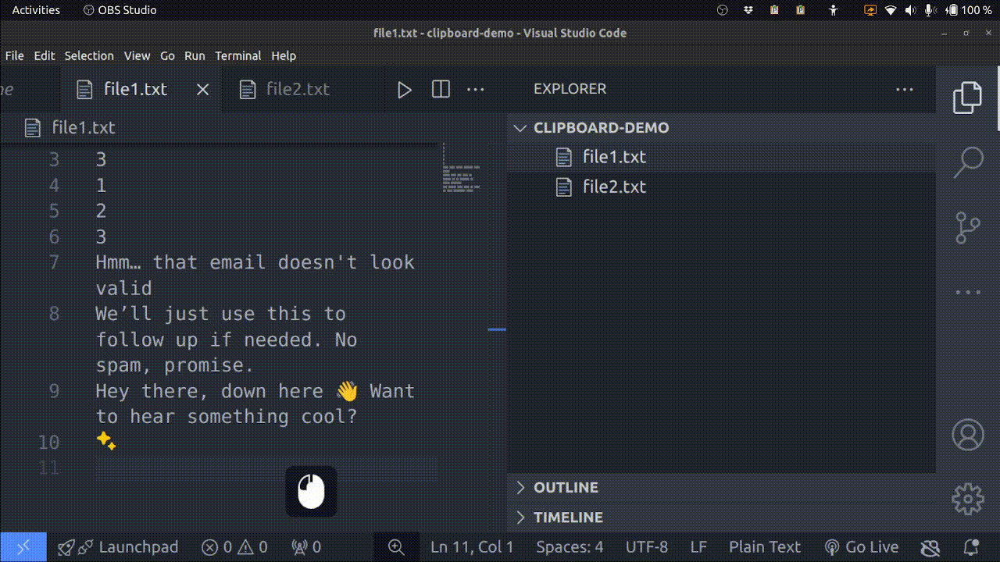

#  Clipboard History & Hotkeys

An extension that lets you access previous clipboard items using shortcuts and completion prompts inside the editor.

## How the Extension Works

- Once VS Code is open, any item copied from any source is recorded in your last N clipboard items.
- Once you come back to an open file in the editor, press the `%` prompt key (this key is configurable) to see the available keyboard items.
- If you know which clipboard item you want, use the shortcut `Ctrl+Shift+[1-9]`, depending on which one you need.
  - `Ctrl+Shift+1` gets the last copied item.
  - `Ctrl+Shift+9` gets the 9th last copied item.
- `Clear Clipboard` in the Command Pallette clears your current clipboard item, as well as any previous items.

## Demo

### Copying items within VS Code


### Clearing the clipboard


### Copying items from other sources


### Using keybinds for pasting



## Clipboard Access for Web version

- When opening the web version of VS Code, you will be prompted for clipboard access; which needs to be granted for the extension to work.
- If the access is given, the extension will start and a notification saying 
  ```
  Web version of Clipboard History & Hotkeys 📋 is now running!
  ``` 
  will be displayed on the bottom right of the editor. 
  > ***Note***: A similar notification will be shown for the desktop version of the extension as well. 

## Contribution Guide

- Feel free to create [issues](https://github.com/rohan-v8rma/clipboard-history-and-hotkeys/issues) if you encounter bugs, or have feature requests.
- Pull requests containing bug fixes and/or new features are welcome!
- I've added the `.vscode/launch.json`, which will help you debug and test the extension.

<!-- Describe specific features of your extension including screenshots of your extension in action. Image paths are relative to this README file.

For example if there is an image subfolder under your extension project workspace:

\!\[feature X\]\(images/feature-x.png\) -->

<!-- > Tip: Many popular extensions utilize animations. This is an excellent way to show off your extension! We recommend short, focused animations that are easy to follow. -->

<!-- ## Requirements

If you have any requirements or dependencies, add a section describing those and how to install and configure them. -->

## Extension Settings

This extension contributes the following settings:

- `clipboard-history-and-hotkeys.clipboardPollInterval`: The intervals (in `ms`) at which the extension checks for new content in the clipboard. The minimum possible value is `4ms` due to limitations of the Web API. Note that this is an approximate figure.
- `clipboard-history-and-hotkeys.numberOfClipboardItems`: The number of clipboard items to store. Default value of `10` ensures all paste keybinds are functional.
- `clipboard-history-and-hotkeys.triggerCharacter`: The character that needs to be typed, to trigger the completion dropdown.

## Design Decisions

- This is a UI extension, instead of a Workspace extension.
  - This means even when code is being accessed through dev containers or SSH, on your local VS Code application, the extension still runs on your local machine and thus all copy and paste operations are recorded.
  - If it had been a Workspace extension, no copy-paste operations would be recorded (not even the ones that take place within the code of the remote environment, since we would not actually be executing copy or paste on the remote machine, but just on our local machine).
  - Read more about types of extensions over [here](https://code.visualstudio.com/api/advanced-topics/remote-extensions#architecture-and-extension-kinds).
- The configuration properties are `application` scoped, so that any changes to the extension settings don't have to be made in each new VS Code window.

## Change Log

See Change Log [here](./CHANGELOG.md).

<!-- ## Known Issues

Calling out known issues can help limit users opening duplicate issues against your extension.

---

## Following extension guidelines

Ensure that you've read through the extensions guidelines and follow the best practices for creating your extension.

* [Extension Guidelines](https://code.visualstudio.com/api/references/extension-guidelines)

## Working with Markdown

You can author your README using Visual Studio Code. Here are some useful editor keyboard shortcuts:

* Split the editor (`Cmd+\` on macOS or `Ctrl+\` on Windows and Linux).
* Toggle preview (`Shift+Cmd+V` on macOS or `Shift+Ctrl+V` on Windows and Linux).
* Press `Ctrl+Space` (Windows, Linux, macOS) to see a list of Markdown snippets.

## For more information

* [Visual Studio Code's Markdown Support](http://code.visualstudio.com/docs/languages/markdown)
* [Markdown Syntax Reference](https://help.github.com/articles/markdown-basics/)

**Enjoy!**

# dev guidelines

- Read [this](https://code.visualstudio.com/api/references/activation-events#onStartupFinished) link to understand why `onStartupFinished` is used as an `activationEvent`. -->